CCiC合成生物学系列课程之

# Cource1 DNA & Molecular cloning

本课程是这次CCiC合成生物学课程系列的第一期，内容较为基础，也是大家都常会使用到的：DNA和分子克隆技术介绍。

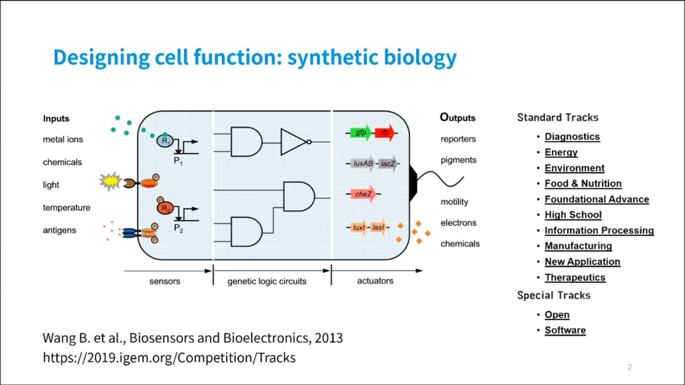

合成生物学，简单来说就是对现有的生命系统进行理性改造，使得其能在特定条件下，完成特定的功能。

比如我们可以改造细菌细胞，给它加上金属离子的检测装置，下游连接荧光蛋白的表达体系，这样细菌就可以作为生物检测器，通过荧光是否发光，判断环境中是否含有特定类型的金属离子。此外，合成生物学的领域很多，就iGEM比赛而言，合成生物学按照**功能**或**目的**分类，可以被划分为十几个track，它可以用来解决现实世界中具体存在的问题，环境问题、能源危机、疾病诊疗、生产实践；它也可以用于帮助人们认识和改造生命系统，利于基础科学的研究。

总之，合成生物学内容非常广泛，主题也充满了多样性。

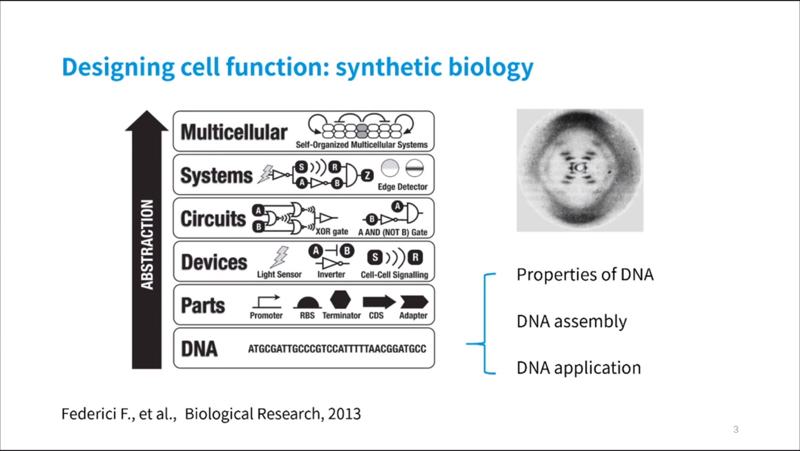

要设计出一个好的工程生命体，需要从多个层次进行深入考虑。

人们把含有特定功能的元件称为**part**，功能相关part可以组成**device**，结合布尔代数逻辑可以形成更加高阶的**circuit**，最终在系统水平产生特定的生物学功能，对于少部分复杂的人造生命系统，还需要考虑到多细胞层次的通讯相互作用等。

考虑到DNA是绝大多数生命系统的遗传物质，承载了遗传信息，决定了元件功能，可以说，合成生物学是DNA上的艺术。除了大家可能以前接触过的DNA结构特性、DNA拼装外，DNA自身还有非常多有趣的应用，本篇的内容将就这三个话题展开。

## DNA的性质

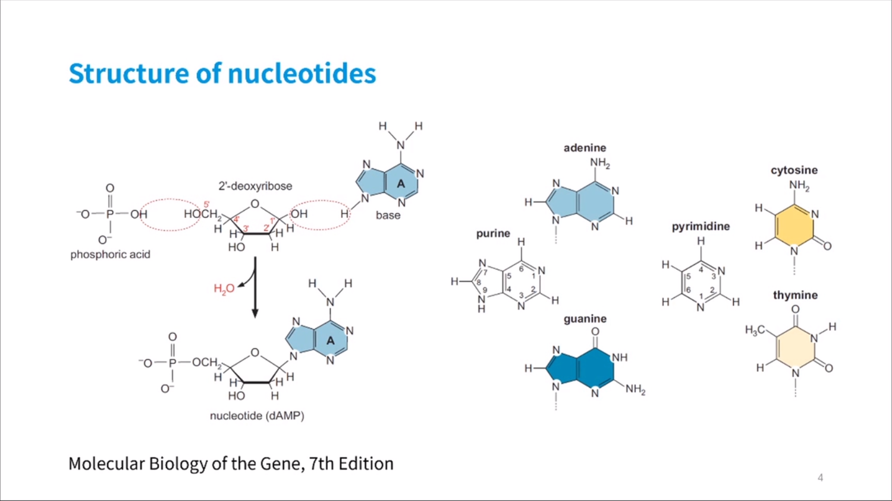

从DNA的组成单元看起，DNA的单元是脱氧核糖核苷酸，中心为脱氧核糖骨架，1号C连接碱基，5号C连接磷酸基团，3号C连接一个羟基，可以与另一个核苷酸分子的磷酸形成磷酸二酯键的共价键。通常情况下碱基有四种类型，缩写分别为ATCG。

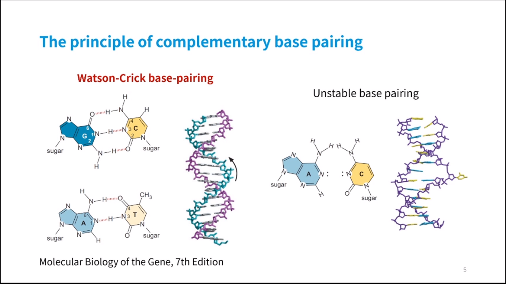

特定的碱基组合，如CG、AT中间可以形成氢键匹配相连，形成如上图所示的结构，这样的过程被称为沃森克里克配对，形成的产物为碱基对(base pair)简写为bp。

当两条DNA链相对的碱基均通过沃森克里克配对时，可以形成的双螺旋结构。如果出现AC这样不匹配的状态，不稳定的结合在二级结构上可能形成鼓泡。

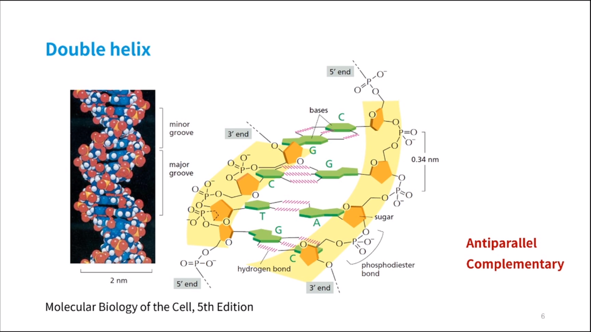

对于双螺旋模型来说，<u>其宽度为2nm，每上升1个bp则上升0.34nm，上升10bp即可绕轴旋转一圈。</u>如果有iGEM队伍需要以DNA为骨架设计项目，这样的参数务必需要大家去熟悉。

双螺旋的外侧是相对亲水的核糖-磷酸链，中央为相对疏水的碱基对。稳定双螺旋的力除了来自碱基间的氢键外，碱基的疏水相互作用、范德华力也不可小觑；来自链外带电阳离子比如镁离子锰离子等，也对DNA结构有重要影响。

这里要强调的是，DNA双链是**反向双螺旋**，两条链的方向是相反的，这对我们很多分子生物学实验操作非常重要。

 

## DNA扩增

在一些特殊的序列位置上，因为碱基互补配对的作用，DNA可能会形成发卡状或十字型。这些非常规的结构对于短链DNA或RNA来说非常重要，可以直接决定其生物学功能，我们会在之后的内容中提到。

 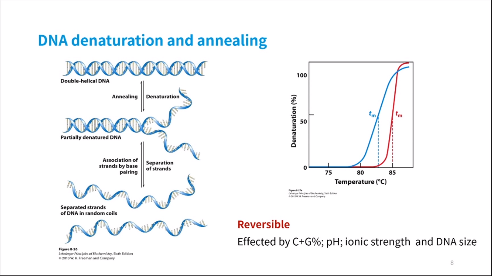

DNA双螺旋结构主要由各类非共价键来维持，在加热、极端pH、变性剂的处理下双链可以被解开为单链；不过如果撤除变性条件，单链也可以通过碱基互补配对恢复双链状态，这个过程是可逆的。

对**变性-复性过程**，科学家们定义变性一半时的温度为**融解温度**$t_m$，$t_m$的高低往往与DNA GC比、长度、环境pH、离子强度相关。$t_m$这个参数也是我们实验中常常会关注的重点。

 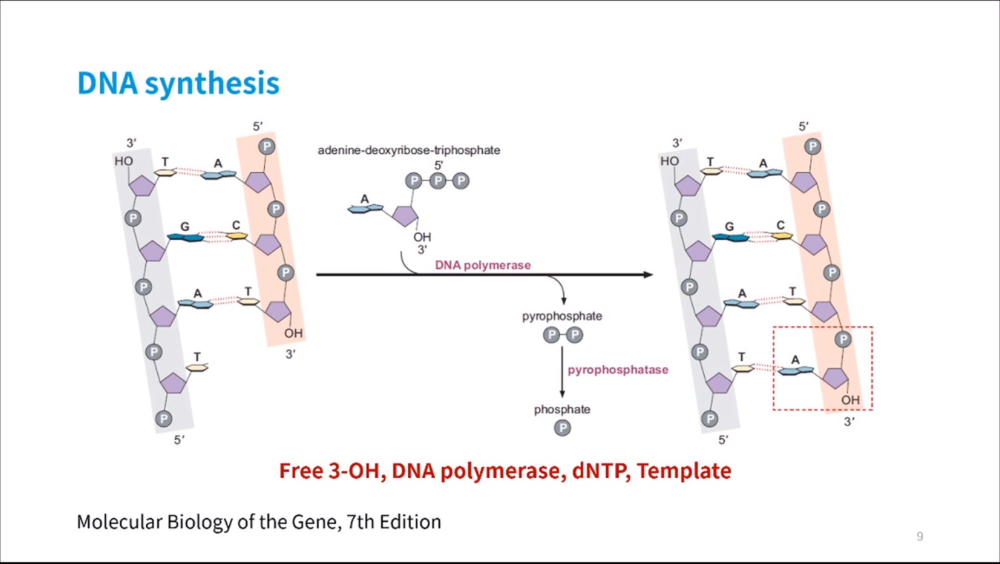

我们在进行分子生物学实验时，通常需要获取和扩增特定的DNA序列。上图展示了DNA聚合的过程。

DNA的聚合有几个必需条件：

1. 待合成的DNA链上应存在游离的3‘羟基，不能从0开始合成；
2. 需要DNA聚合酶；
3. 参与合成的底物分子是三磷酸脱氧核糖核苷酸，dNTP；
4. 要完成高精度的复制，需要有DNA模板。

基于以上几个要素，人们开发了一种叫做**PCR**的生化反应，可以在短时间中获得大量DNA产物。

我们可以在反应体系中放入<u>模板、dNTP，加入酶和带有3-OH</u>的物质即可。由于体外条件没有DNA解旋酶等辅助蛋白，为了打开双螺旋，PCR通过高温变性的方式破坏碱基相互作用。为了承受高温，科学家们从耐热菌中挖掘出了DNA聚合酶，Taq是比较常见的一种类型。

提供3-OH的分子也很容易想到，那就是通过化学方式合成的短链DNA引物了。

 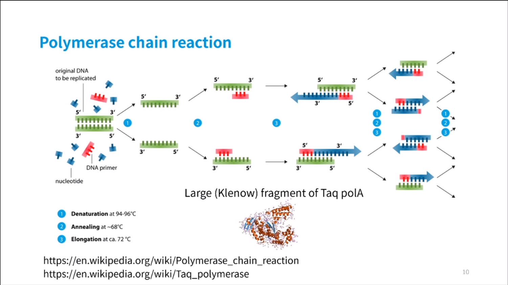

虽然PCR目前已经较为成熟，但有时候依然会出现PCR结束没有得到产物的悲伤故事。所以在PCR过程中有一些关键要素值得我们去注意，其中最重要的还是引物设计部分。

 

简单点说，引物设计就是在待扩增片段的两头分别牵出两端序列就行。

讲究的地方在于：首先我们要明确引物的方向一定要和片段合成的方向匹配，否则P是P不出来的。

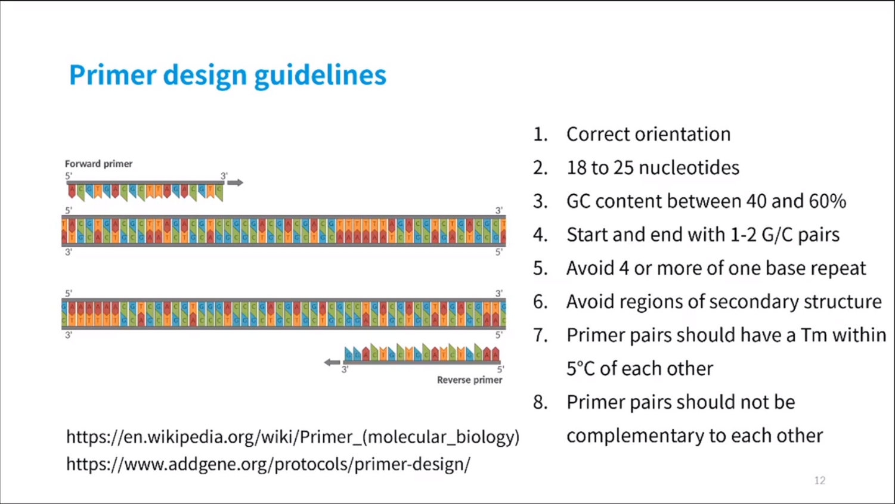

引物的长度主要和使用目的相关，最好情况下和模板匹配的部分能有18-25bp，太短特异性差，太长结合效率和成本都可能会有影响。

引物CG比、两头的碱基类型、引物内部是否有重复片段、是否有二级结构的可能，这些会影响到引物与模板的结合准确性和结合效率。

引物之间注意下$t_m$值差距不要太大，也不要相互互补成为引物二聚体。

不过，引物的设计总体上来说还是相对自由的，可以根据实际情况酌情调整，不用过于教条主义。

 

PCR往往用于获取DNA片段，用于分子克隆。科学家们后来也以PCR为基础，开发了不少延伸技术。

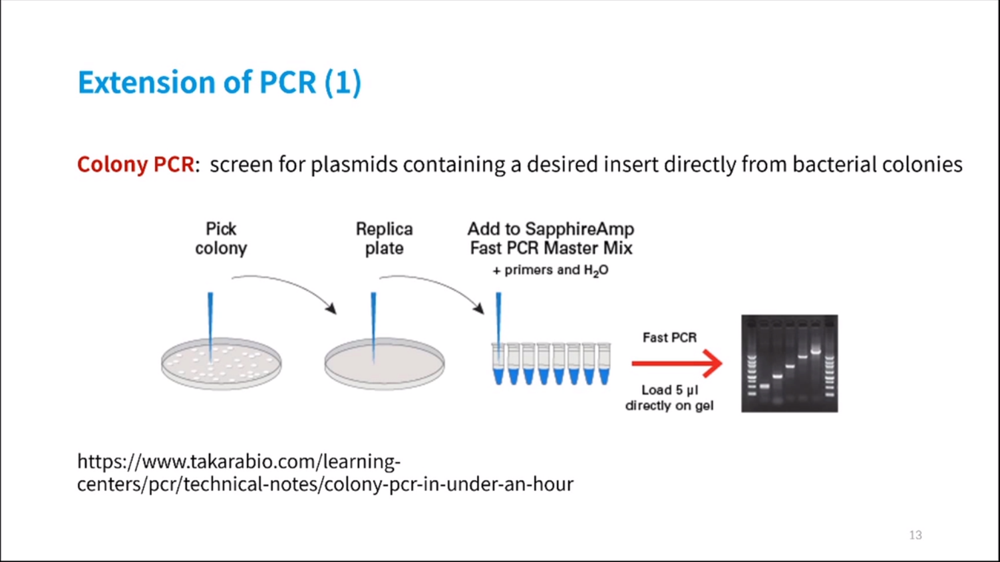

对于准确性要求不是特别高、判断重组质粒是否成功的场合，我们可直接用菌落作为模板进行PCR，可以极大程度提高实验效率和反应通量，称为菌落PCR，目前已经广泛用于各类分子实验操作中。

 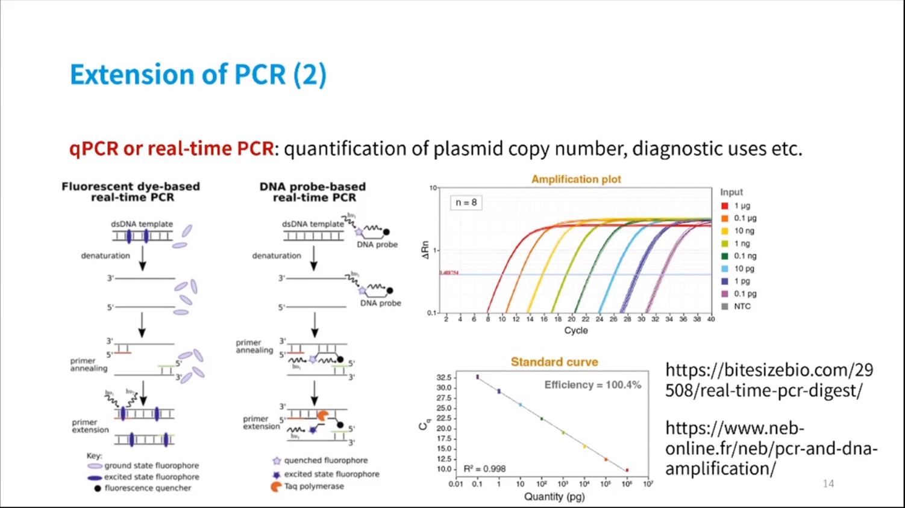

传统的PCR不能对试管中的过程进行实时检测，也很难对模板量进行有效定量。

为了解决这个问题，科学家们在PCR反应中通过引入荧光染料或荧光探针的形式，可以对PCR产物浓度进行实时定量的检测。这就是**定量PCR**或者实时PCR。这类PCR形式可以让我们清楚的知道初始样本中有多少模板。

拿着荧光信号上涨的曲线，通过设定阈值，我们可以读出达到阈值所需要的循环数，数字越少，对应样本中模板就越多，可以实现较好的半定量比较。

如果有循环数-DNA模板量的标准曲线，甚至可以算出样本中模板的绝对数，实现精确的绝对定量。

 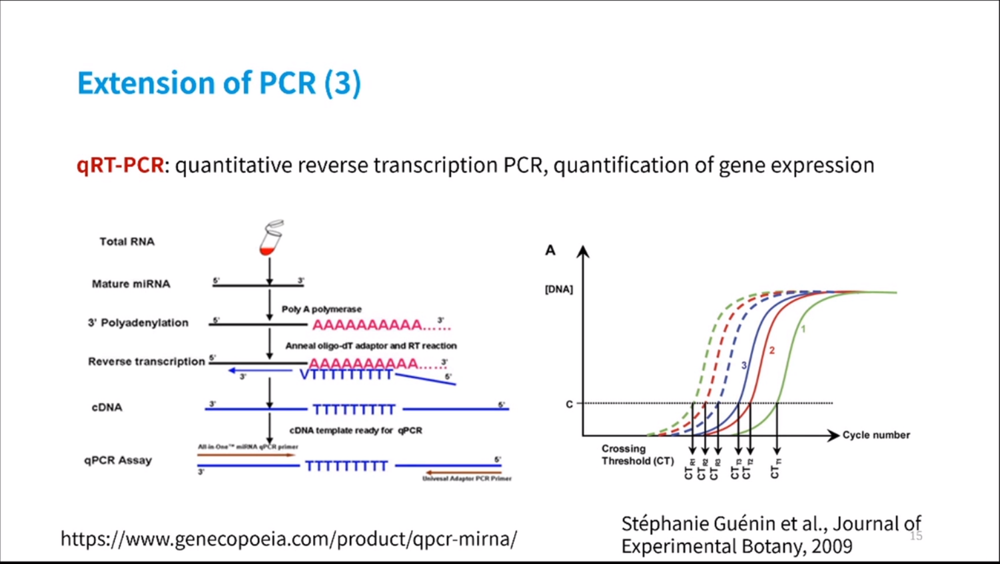

定量PCR是对DNA模板进行计量的，对RNA模板，只需要引入一步反转录的过程，将RNA转化为cDNA，再以cDNA为模板进行定量PCR，这整套操作称为反转录PCR，其数据类型也和上一种方式基本一致。

 

考虑到qPCR、qRT-PCR都可以对样本中模板链的数目进行定量或半定量的测量，因此他们也常被用于病毒或病菌检测。

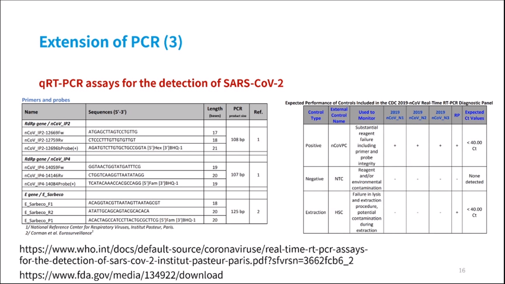

以2020年爆发的新冠病毒疫情中的新冠病毒检测为例，WHO官网上推荐了新冠病毒检测的引物和探针序列，美国FDA也为qRT-PCR进行病毒检测提出了参考标准。相对来说，PCR在病毒检测方面已经非常的成熟。

 

虽然qRT-PCR、qPCR能精确的计量模板量，使用方法成熟，商业kit也很多，但也存在有一些问题。

比如<u>qRT-PCR的引物设计非常讲究</u>，难度比一般PCR的引物设计难度大一些；对病原体RNA，在进行实验时需要经过灭活流程，可能会影响RNA的提取质量，而实验操作中的污染控制，对于qRT-PCR的效果的影响也很大；为了做好定量的效果，设计control也是有必要的，找一个好的control也是有难度的事情；对于数据处理，选定阈值相对手动，阈值的高低对ct值的判定也有影响。当然，qRT-PCR需要特定的PCR仪，不仅有好的温度控制系统，还得有荧光检测系统，价格较高。

综上，有没有可能设计出更好的核酸或者微生物检测方式？感兴趣的同学可以思考一下。

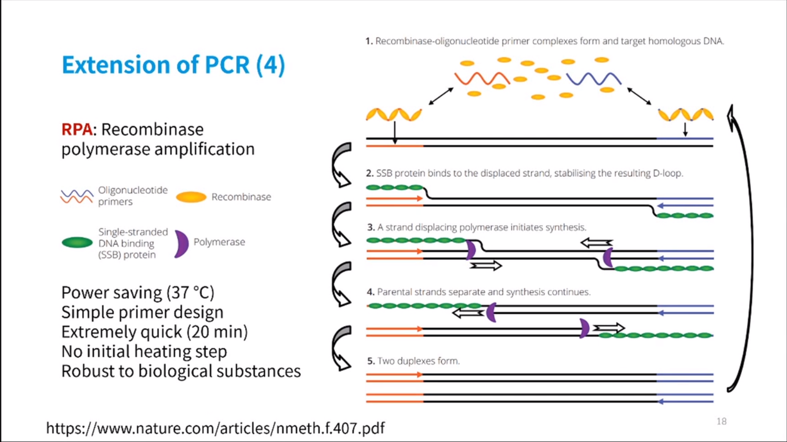

PCR反应因为需要反复升温降温，需要较好的温度控制模块，限制了其的广泛使用。就在几年前，科学家们开发了一个叫做**RPA**的反应过程，可以在常温条件下实现特定DNA的扩增。

在RPA的反应体系中，除了DNA聚合酶外，还有重组酶和单链结合蛋白。反应过程如上图所示：首先是重组酶与引物结合，形成蛋白-DNA复合物。接着在dsDNA中寻找同源序列。一旦引物定位了同源序列，就会发生链交换反应形成并启动DNA合成，对模板上的目标区域进行指数式扩增。而被替换的DNA链与SSB（单链DNA结合蛋白）结合，防止进一步被替换。整个过程进行得非常快，一般可在十分钟之内产物就可以通过检测手段检出了。

 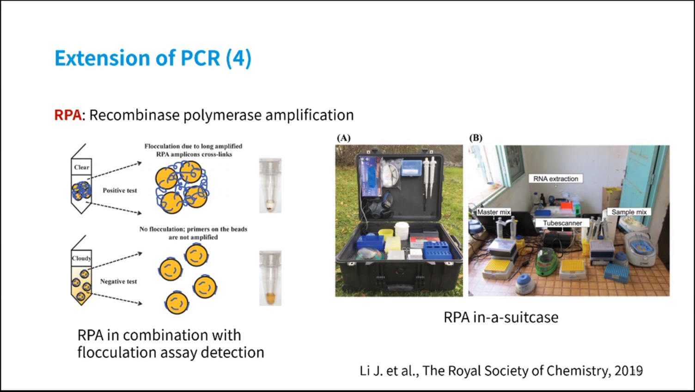

PCR产物的读取需要经过电泳和染料染色，但如果将RPA和磁珠絮状沉淀试验体系结合起来，就能通过肉眼观察试管中是否沉降或是否悬浊来判断RPA是否发生，这也可以用于快速的样品检测。

考虑到这个过程不用PCR仪，不用电泳和成像设备，RPA可以被开发成在简易实验条件中使用。

 

还有一种可能被用到的PCR衍生品叫做易错PCR，与一般PCR希望获取更多更准确的产物不同，易错PCR希望向特定序列中引入大量突变。

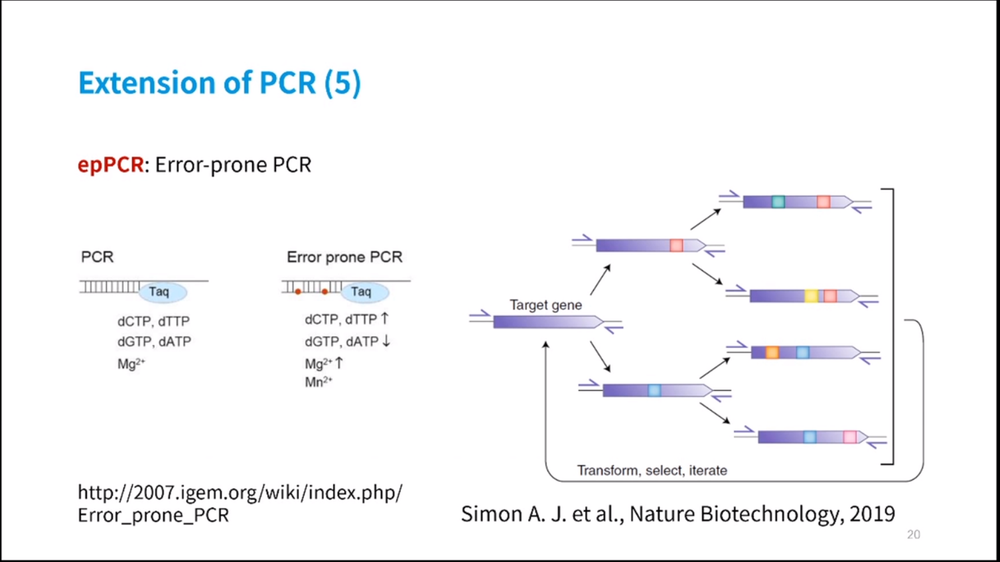

有了突变库就可以做很多筛选，对于**定向演化**相关的工作，比如，获取更好功能的生物元件、获取更多类型功能的生物元件都非常有用。

|             | PCR               | Colony PCR              | qPCR/qRT-PCR                   | RPA                          | ep-PCR         |
| ----------- | ----------------- | ----------------------- | ------------------------------ | ---------------------------- | -------------- |
| Template    | DNA               | Single colony           | DNA/RNA                        | DNA                          | DNA            |
| Equipment   | PCR instrument    | PCR instrument          | Real-time PCR system           | No                           | PCR instrument |
| Application | DNA amplification | Test of recombinant DNA | DNA/RNA quantitative detection | DNA amplification/ detection | Mutant library |

我们总结了以上的汇总表格，大家可以根据自己实际的使用需求，合理的选择将要使用的PCR类型。

 

## 分子克隆

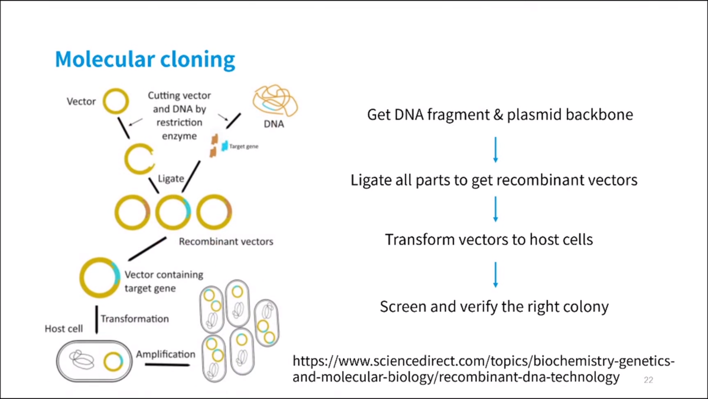

有了PCR之后，人类可以大规模且快速地获取特定DNA片段，也就可以进行各种类型的基因工程改造。获取改造后重组DNA的过程就叫**分子克隆**。

简单点说，分子克隆就是通过PCR或酶切的方式获取目的DNA片段，通过拼接将其与载体DNA相连，之后进行载体的转化、筛选，直到获取正确序列的重组DNA的过程。

 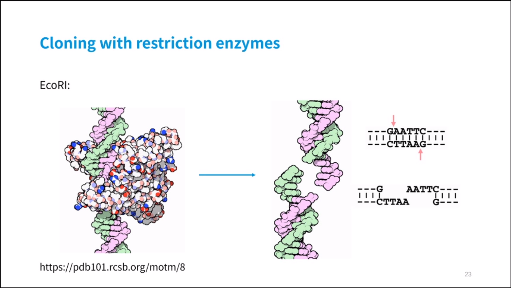

比较传统的分子克隆工具是我们的限制性内切酶，它可以识别特定的DNA序列并完成切割。部分限制性内切酶可以形成如上图所示的DNA粘性末端。

 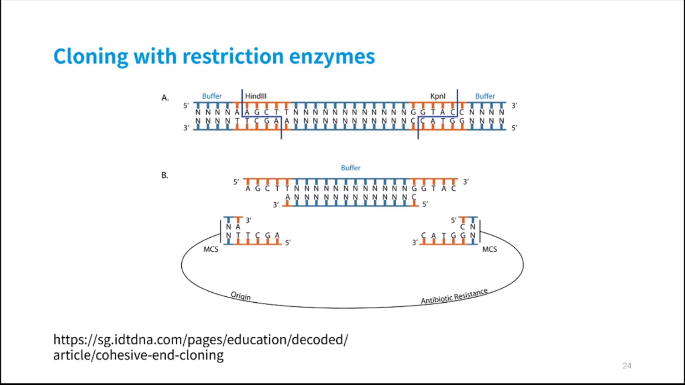

具有相同粘性末端的DNA可以通过碱基互补配对的形式相互连接，形成我们的重组DNA。

这种方式虽然简单，但限制条件也比较多，比如需要去找很多种不同类型的限制性内切酶，才能充分识别和切割载体或目的DNA，如果要让他们能够相连，还必须要让它们形成共同的粘性末端。

这就需要人们花大量时间去寻找开发特定的限制性内切酶。

 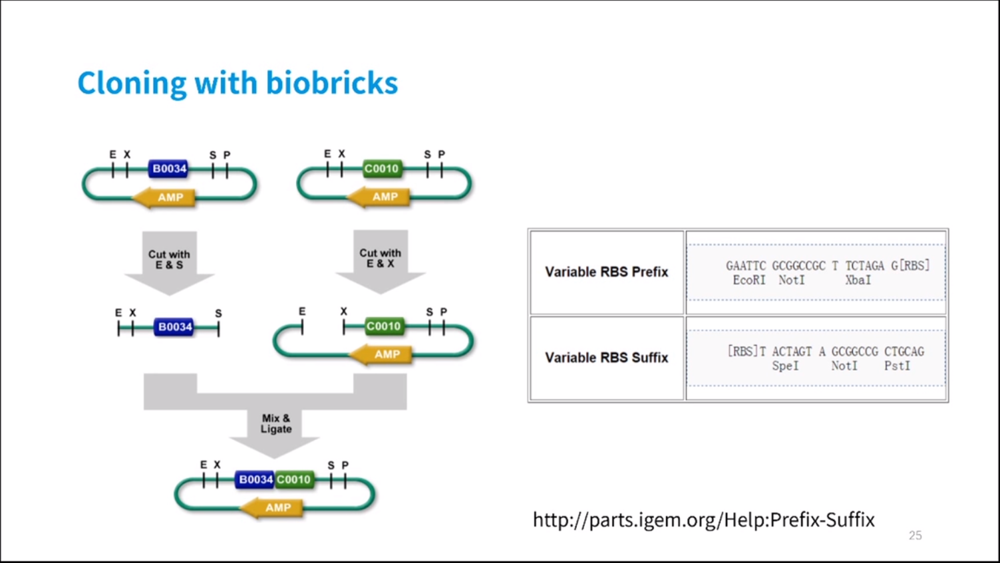

iGEM为了让这个过程更加可控更为标准化，提出了**生物砖(biobrick)**的概念，在功能DNA的前后加上特定的前缀和后缀，在这个前后缀中内含有四种特定的内切酶，因此所有的分子克隆、生物砖的拼接可以通过这四种内切酶完成。

 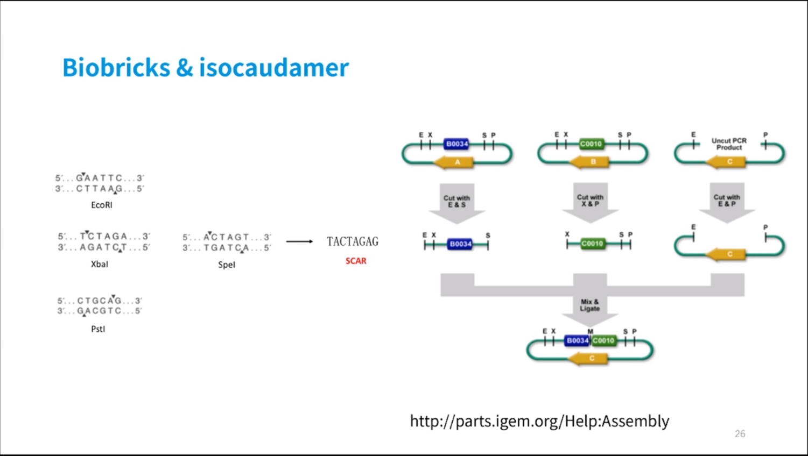

这四种酶中，由于XbaI和SpeI他们所切割出来的粘性末端是一致的，他们也被称为**同尾酶**。

而这个切口如果被连接上之后，即不能被XbaI识别，又不能被SpeI识别，因此可以成为非常稳固的Scar。

这样就可以让多个酶切连接过程放到一个试管中进行，有效地提升了分子克隆效率。

 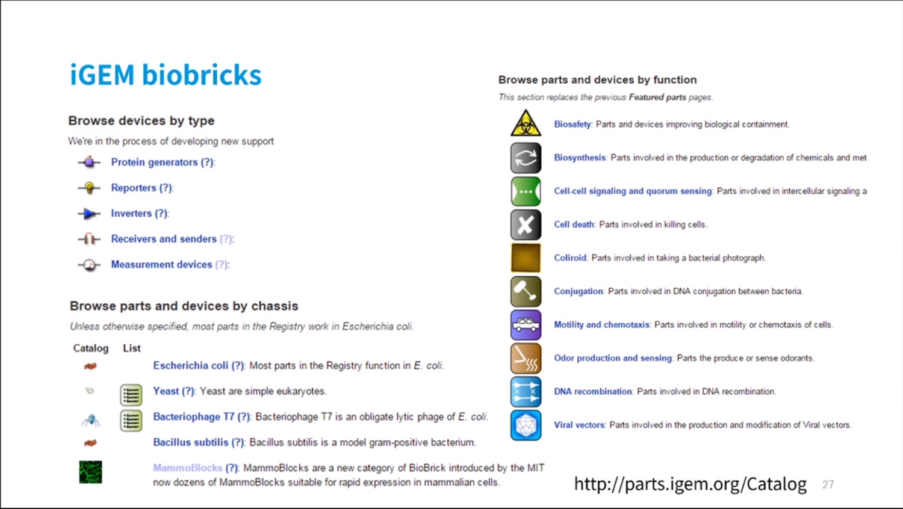

说到生物砖，在[part][parts.igem.org]的网页上目前已经收录了万余种各种类型的生物砖，iGEM官方也特别友善地将这些生物砖按照其类型、物种来源、可发挥的功能分成很多种类别。

如果在进行brainstorm时想要寻找特定生物砖以进行可行性评估，这个网页可以提供不少有用信息。

 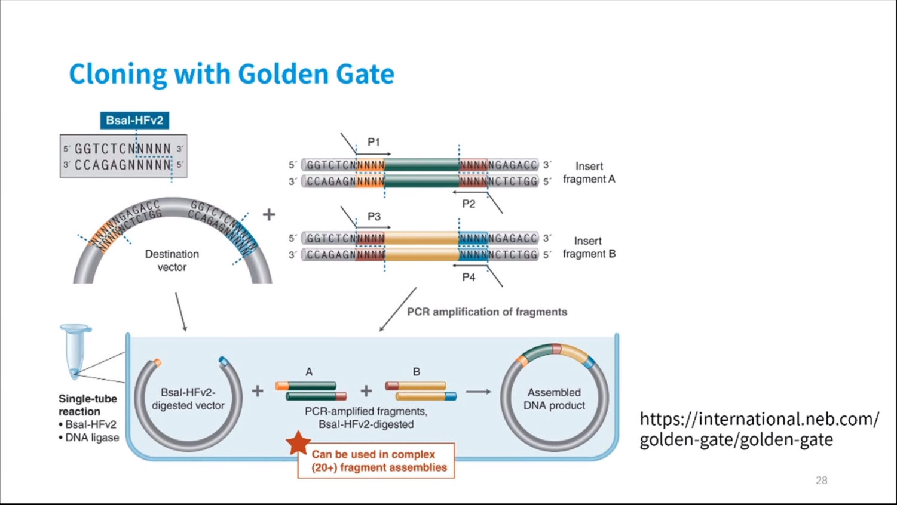

在这张图上我们可以看到，BsaI这样的限制性内切酶和刚才的EcoRI有些许差别，EcoRI识别并切割特定的DNA序列，而BsaI则识别一段序列，但切割旁边的序列。

有意思的是，BsaI所切割的位置并没没有序列特异性的要求，它产生的粘性末端可以是NNNN，换句话说我们可以人工设计这一段粘性末端。

基于BsaI这样的限制性内切酶，科学家们开发出了叫做**golden gate**的克隆方式。

第一步我们需要用PCR的方式在目的片段前后加上BsaI的酶切位点。由于在两端，因此进行切割后BsaI的识别区就掉了，剩下的粘性末端就可以和载体或其他片段的粘性末端相连。

由于只用到了一种内切酶，Golden gate有一大好处是可以在一个试管里进行多个片段的切割和拼接。

对于golden gate还有一个小的tip：酶蛋白在识别和切割DNA时，还要占据识别位点两边的若干个碱基，这些碱基对内切酶的稳定结合和切割效果有很大影响，被称为保护碱基，对于PCR产物两头设计酶切位点的引物时需要额外注意。

虽然golden gate有不少好处，不过<u>如果目的片段或载体上有BsaI位点的话，就不能使用这种方法了</u>。

 

那么有没有可以不依赖限制性内切酶的分子克隆方法呢？**Gibson assembly**就是这样一种典型。

它不需要酶切位点，只需要待拼接片段中间有同源区，可以形成overlap即可。反应体系中的核酸外切酶可以切割DNA的5‘端，产生超长的粘性末端，因为同源区域的存在，两个片段可以结合到一起，顺带提供了3’羟基为DNA聚合酶提供延伸空间，填补外切酶切出来的空隙。最后通过DNA连接酶将片段中的nick补上，我们就能获得完整的重组DNA了。

 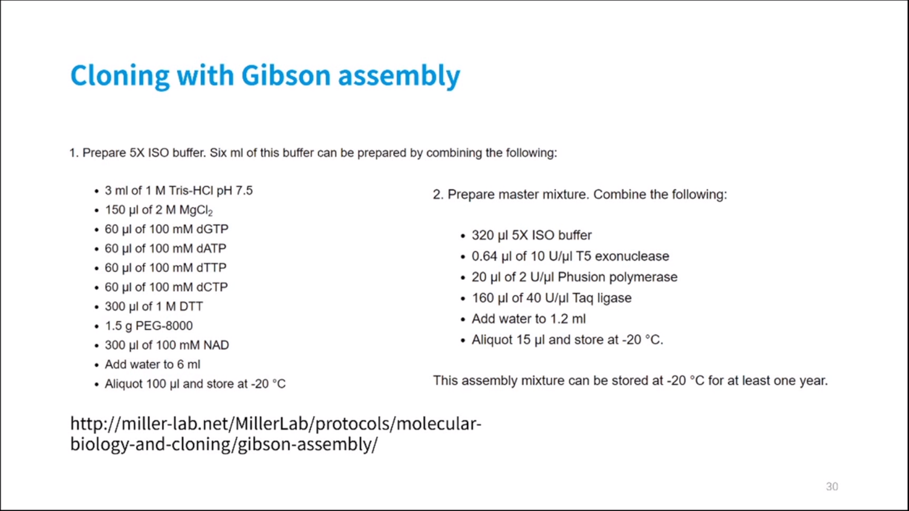

在Miller实验室的官网上，我们可以找到gibson assembly的配方和实验方法，感兴趣的同学可以按照这个流程去配置自己的片段连接体系。

 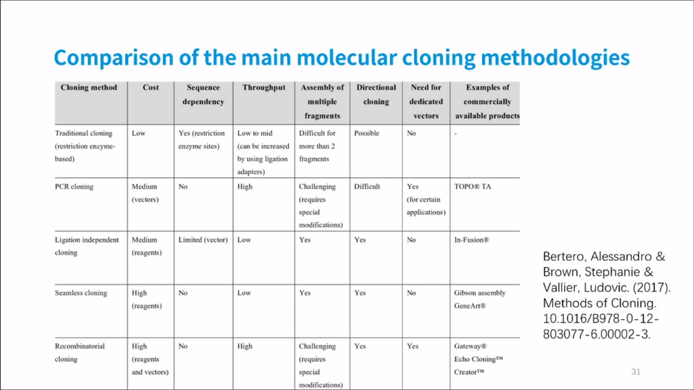

最后这里有一个表格，也是简单的比较了一下市面上目前比较常用的几种基因拼接方法，可以根据自己的实际需求进行选择。

***

如果大家对这个系列的内容有什么建议意见想法，欢迎发送邮件至admin@ccicmail.org，谢谢大家！

